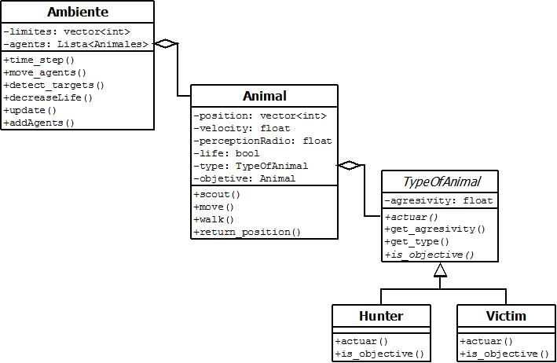

Tutorial
========

En este tutorial te enseñaremos como realizar una simulación en *Survival*

    
    

ETAPAS: 

1. Para realizar una simulación con **SURVIVAL** se deben definir los siguientes parámtetros: 

    - **Tiempo Limite**:tiempo que dura la simulacion

    - **Limites**: vector (x, y) que determinan el espacio donde se desarrolla la simulacion

    - **Cantidad de animales**: numero de animales que se quiere crear en la simulacion

2. Una vez determinados los parametros generales de la simulacion, el sistema se encarga de generar los animales (agents) necesarios para poblar el ambiente. 

3. En cada paso del tiempo (`time_step`) se realizan las siguientes acciones:
    - Cada agente detecta su proximo target (`objective`)
    - Actua de acuerdo a su objetivo
    - Disminuye su tiempo de vida
    - Se actualiza el listado de agentes dentro del ambiente
    - Se grafica la situacion actual del ambiente
    

